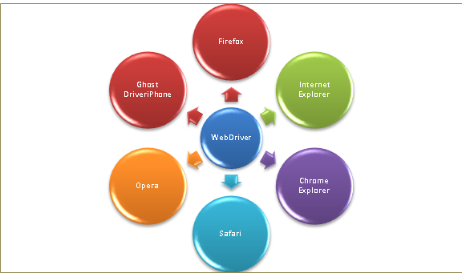
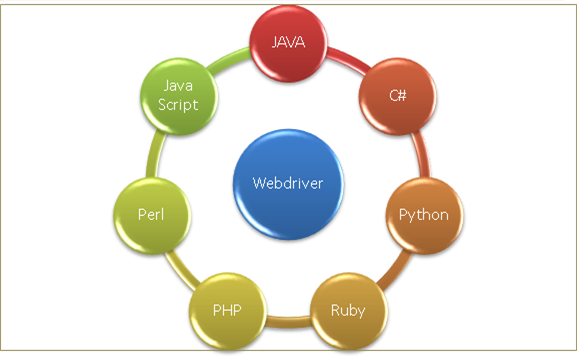
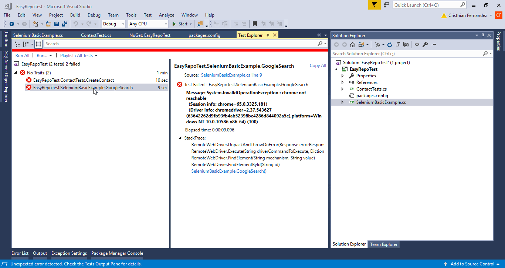

# User Interface Automated Tests
Many, perhaps most, software applications today are written as web-based applications to be run in an Internet browser. The effectiveness of testing these applications varies widely among companies and organizations. In an era of highly interactive and responsive software processes where many organizations are using some form of Agile methodology, test automation is frequently becoming a requirement for software projects. Test automation is often the answer. Test automation means using a software tool to run repeatable tests against the application to be tested. For regression testing this provides that responsiveness.

There are many advantages to test automation. Most are related to the repeatability of the tests and the speed at which the tests can be executed. There are a number of commercial and open source tools available for assisting with the development of test automation. [Selenium](https://www.seleniumhq.org/) is possibly the most widely-used open source solution. 

There are other alternatives, some of them are tools built on top Selenium, others are simply frameworks that repeat the same concept; a programmable API that lets you control de Browser by faking the operations that a user would perform while navigating through the application pages. Some of these are:

- https://www.ranorex.com
- https://www.telerik.com/teststudio
- https://leaptest.com
- https://www.codeproject.com/Tips/658947/Watin-An-Automation-Testing-in-NET


# When to Automate UI Tests
It is not always advantageous to automate test cases. There are times when manual testing may be more appropriate. For instance, if the application’s user interface will change considerably in the near future, then any automation might need to be rewritten anyway. Also, sometimes there simply is not enough time to build test automation. For the short term, manual testing may be more effective. If an application has a very tight deadline, there is currently no test automation available, and it’s imperative that the testing get done within that time frame, then manual testing is the best solution.

# About Selenium
[Selenium](https://www.seleniumhq.org/) is a set of tools and libraries meant to automate and run different browsers. It has different components, one of which is the WebDriver. 

The [WebDriver](https://www.seleniumhq.org/projects/webdriver/) is a library, very well designed and easy to understand that provides access to the different components and actions that most browsers have available. 

Probably the biggest challenge in designing such a tool is the overwhelming variety of Browsers and Platforms available in the market. So, how can we find the common ground among them so we can write test specifications once and run them in different browsers? But not only that, also several combinations of browsers and Operating Systems? 



Even more, how can we make these libraries available to different coding languages, so we can write the tests in the same way no matter if we are using c#, Java or Python?



Selenium and the WebDriver tackle above problems providing an elegant API built in several layers. 

# Selenium Example

Let's analyze this simple piece of code to see the different elements we are talking about

``` c#
[Fact]
public void GoogleSearch()
{
    // 1. Initialize the Driver
    using (var driver = new ChromeDriver())
    {
        // 2. Go to the "Google" homepage
        driver.Navigate().GoToUrl("http://www.google.com");

        // 3. Find the search box on the page
        var searchBox = driver.FindElementById("lst-ib");

        // 4. Enter the text to search for
        searchBox.SendKeys("Selenium Test");

        // 5. Find the search button
        var searchButton = driver.FindElementByName("btnK");

        // 6. Click on it to start the search
        searchButton.Submit();

        // 7. Find the "Id" of the "Div" containing results stats,
        // located just above the results table.
        var searchResults = driver.FindElementById("resultStats");

        // 8. TODO: Perform any operations to make sure the behavior is correct 
        Assert.Contains("seconds", searchResults.Text);
    }
}
```

First of all, Selenium is available to be coded using different languages. Each language/platform require you to download and reference the appropriate libraries. In this case, we are using Selenium for c# which is available as a nuget package for Visual Studio. You can download it from here: https://www.nuget.org/packages/Selenium.WebDriver/

Let's move onto analyzing the code. In summary, what this code does is opening a Chrome browser window, navigate to the google page and perform a search. Easy, right?

If I run the test above I get the following result:



```c#
// 1. Initialize the Driver
using(var driver = new ChromeDriver())
```
This is how you tell Visual Studio you want to automate the **Chrome** Browser. If we wanted to automate other browsers, there are specific namespaces for them.

The line initializes and gets the object that will let you interact with Chrome. 

But wait, didn't we say before that I am able to write a test and run it in different browsers and operating systems? 
Why do I need to reference Chrome specifically? 
What if I want to run the same test in Internet Explorer? Do I need to write the same test again?

There is in fact a way to initialize a generic browser and only specify which particular one to use at runtime by a configuration file or any other mechanism. 
For the sake of simplicity, I'm creating a specific reference to Chrome, but the same concepts apply to the other available drivers. 

```c#
// 2. Go to the "Google" homepage
driver.Navigate().GoToUrl("http://www.google.com");
```
This is how we tell the browser to go an type a web address in the navigation bar and hit enter. 

```c#
// 3. Find the search box on the page
var searchBox = driver.FindElementById("lst-ib");
```
Here we are saying, go find me the search text box. 
If we were testing any other type of application, for instance a record form, this would be the way to go find a field in that form and type a value on it later.
If that text box that is not available, because is hidden, or it wasn't rendered, an error will be thrown and the test will fail. 

```c#
// 4. Enter the text to search for
searchBox.SendKeys("Selenium Test");
```
Once we got the text box, we can type any value we want on it.

```c#
// 5. Find the search button
var searchButton = driver.FindElementByName("btnK");
```
The same way we had to find the search box, now we have to find the search button. This is a very common pattern in Selenium. You first search for the UI element you want to interact with, and then perform the interaction, for instance typing something, clicking on it, swipe, select a value from a drop-down list, or do whatever you need to. Every type of UI element offer different type of interactions.

```c#
// 6. Click on it to start the search
searchButton.Submit();
```
And Click on it. At this stage, the browser will connect to the server, send a request and render the results. Even though this sometimes happens very fast, especially in the Google search, it takes some time. 
If I perform the next step of the script immediately after clicking the button, the UI elements may not be present just yet, and my test would fail. 
So, how do I make sure the page code has finished rendering or performing the operations before I continue running the tests?

Selenium provides a waiting mechanism that is transparent, but configurable. Every time it detects the browser is performing a task, like a server request, it waits until it is completed before moving to the next step. 
Sometimes, this is not enough, and we need to wait longer. 
For those cases, there are other available API functions exposed to perform waits.

```c#
// 7. Find the "Id" of the "Div" containing results stats,
// located just above the results table.
var searchResults = driver.FindElementById("resultStats");
```
Now that the search is completed, I can add code to check if the results are the ones that I expected. 
At this point, I can use the normal Assert methods available in any test framework to make the test fail if there's something wrong in the result. 
The way I make sure the page has the right values or the correct state is by the mechanism explained in #4: Search the page UI element, then get the contained value. 

```c#
// 8. TODO: Perform any operations to make sure the behavior is correct 
Assert.Contains("seconds", searchResults.Text);
```
Once I have the reference to the DIV element, I can read and check its contents. 

# About EasyRepro

As you've seen, Selenium is a comprehensive robust tool that will allow you to write User Interface tests for Dynamics CRM. It has all you need, but it becomes quite laborious to write medium and complex tests. 

Every click and form field filling requires a few lines of code. [There are patterns](https://saucelabs.com/blog/selenium-design-patterns) to help you increase the reusability of your tests to the maximum, but still, some tests can be hard and time consuming to write. 

But at the same time Dynamics 365 has a feature that comes in really handy to reduce the amount of code required; every single form, section and field is rendered in the same way, it follows the same structure, and it has a perfectly defined naming convention for UI elements. 

This increases the chances of writing reusable code. If you think about it, given an entity and the list of attributes in it, you know what the URL of a form will be, and how the UI elements are going to be named. If you also know the attribute data types, you know what type of elements (text box, option set, dropdown) are going to be rendered for each attribute.

Well, the clever guys at Microsoft must have came up with the same conclusion, and decided to create a framework for this; it is called [EasyRepro](https://github.com/Microsoft/EasyRepro).

EasyRepro is a library meant to facilitate the writing of UI tests for Dynamics 365, leveraging the well defined structure mentioned above. 

# Creating your first EasyRepro test

Let's see a small example and see how this would work.

First of all, the library is distributed through a nuget package that can be downloaded from here: https://www.nuget.org/packages/Dynamics365.UIAutomation.Api/


```c#
[Fact]
public void CreateContact()
{
    // 1. Create instance of the browser
    using (var xrmBrowser = new XrmBrowser(new BrowserOptions() { BrowserType=BrowserType.Chrome }))
    {
        var url = new Uri("http://orgname.crm.dynamics.com");
        var userName = "admin@youruser.onmicrosoft.com".ToSecureString();
        var pwd = "yourpassword".ToSecureString();
        // 2. Log-in to Dynamics 365
        xrmBrowser.LoginPage.Login(url, userName, pwd);

        xrmBrowser.ThinkTime(500);

        // 3. Go to Sales/Accounts using the Sitemap
        xrmBrowser.Navigation.OpenSubArea("Sales", "Contacts");

        xrmBrowser.ThinkTime(500);

        // 4. Change the active view
        xrmBrowser.Grid.SwitchView("Active Contacts");

        xrmBrowser.ThinkTime(500);

        //5. Click on the "New" button
        xrmBrowser.CommandBar.ClickCommand("New");

        xrmBrowser.ThinkTime(1000);

        var fields = new List<Field>
        {
            new Field() {Id = "firstname", Value = "Test"},
            new Field() {Id = "lastname", Value = "Contact"}
        };

        //6. Set the attribute values in the form
        xrmBrowser.Entity.SetValue(new CompositeControl() { Id = "fullname", Fields = fields });
        xrmBrowser.Entity.SetValue("emailaddress1", "test@contoso.com");
        xrmBrowser.Entity.SetValue("mobilephone", "555-555-5555");
        xrmBrowser.Entity.SetValue("birthdate", DateTime.Parse("11/1/1980"));
        xrmBrowser.Entity.SetValue(new OptionSet { Name = "preferredcontactmethodcode", Value = "Email" });

        //7. Save the new record
        xrmBrowser.CommandBar.ClickCommand("Save");
    }
}
```

If we run the test above, this would be the result:


Now let's analyze the most important parts:

```c#
// 1. Create instance of the browser
using (var xrmBrowser = new XrmBrowser(new BrowserOptions() { BrowserType=BrowserType.Chrome }))
```
This creates an instance of the XrmBrowser, which is the main object that will contain the methods to interact with Dynamics. This is also the main difference with normal Selenium tests; I no longer need to create a specific WebDriver object for each browser type. EasyRepro sets this XrmBrowser object which will do all the job for us. I only need to specify what Browser I want to run against as a parameter in the constructor. 

This value along with the url and user credentials, can and must ne read from a configuration source, like the app.config file.

```c#
// 2. Log-in to Dynamics 365
xrmBrowser.LoginPage.Login(url, userName, pwd);
```
This is just how we tell to the Browser we want to perform the necessary steps to log in into the application. 

Again, this is the cool part of EasyRepro. Given that the Login page, its URL and all the UI elements are the same for any given CRM Online instance, I can encapsulate all of the logic for performing that interaction in a function, and just use it providing the relevant information. In this case, the url, user and password. 

```c#
// 3. Go to Sales/Accounts using the Sitemap
xrmBrowser.Navigation.OpenSubArea("Sales", "Contacts");
```

It's the same story here. The navigation and the sitemap are made of several UI elements, and in order to click on any of them I need to know how's that structure rendered and how are its parts glue together. With EasyRepro, I only need to provide what's relevant. That I want to click on the **Sales** area of the site map and the **Contacts** section of it. EasyRepro will take care of the rest. 

```c#
// 4. Change the active view
xrmBrowser.Grid.SwitchView("Active Contacts");
```
After clicking on the desired sitemap item, the browser will navigate to the main view of the contacts entity. The main view can be the default one, which may or may not ne the one that I want to use, so with the line above, I make sure that view is selected. 

```c#
//5. Click on the "New" button
xrmBrowser.CommandBar.ClickCommand("New");
```
The CommandBar object provides the ClickCommand method to interact with the Ribbons. In this case, we provide the Text on the button we want to click in. It also works with dropdown buttons.

```c#
//6. Set the attribute values in the form
xrmBrowser.Entity.SetValue(new CompositeControl() { Id = "fullname", Fields = fields });
xrmBrowser.Entity.SetValue("emailaddress1", "test@contoso.com");
```
Now comes the interesting stuff. Where we set the values of the record. The account entity is a good example of interaction with composite fields, where the name in this case is made of other parts. 

```c#
//7. Save the new record
xrmBrowser.CommandBar.ClickCommand("Save");
```
And finally, as we've seen before, we can use the CommandBar object to click on the **Save** button.

And now what?

The next step in this test should be to check the status of the records. The usual requirement when creating a record is to set some values by default, so we would like to make sure these fields were populated correctly. 

The way to do it is through the normal Assert methods available in any test framework. 

In order to read the value of an attribute you would need something like
```c#
var url = xrmBrowser.Entity.GetValue("websiteurl");
``` 

# Desirable features in UI Tests

Telemetry, Logging and screenshots. 

Configurable. Write once, run in multiple platforms.

# References
https://msdn.microsoft.com/en-us/library/dd286726.aspx
https://www.seleniumhq.org/docs/01_introducing_selenium.jsp
https://developer.mozilla.org/en-US/docs/Learn/Tools_and_testing/Cross_browser_testing/Automated_testing
http://toolsqa.com/selenium-c-sharp/
https://www.codeproject.com/Articles/1016775/Getting-Started-with-WebDriver-Csharp-in-Minutes
https://crmtipoftheday.com/967/ui-testing-for-dynamics-365/
