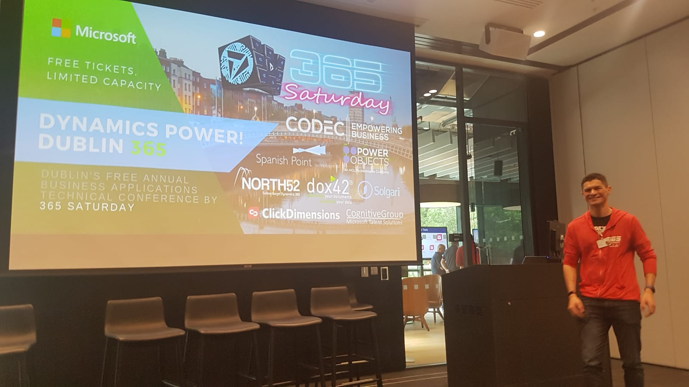

Solution Architect having fun in this profession for 20 years. I have a broad experience in different sectors like Aircraft Manufacturing, Finance, Environmental Protection, Chemical, Media and Public Sector.

During these years I worked in different roles but mainly designing and delivering systems based on the Microsoft platform. Lately I have had the pleasure to learn and contribute to the Dynamics 365 platform, where I help customers to get the most of their Dynamics implementation, either in on-premise deployments or in the cloud. 

I am an open creative person, with energy and integrity. I really enjoy working in collaborative environments, I adapt very well to changes and I am constantly looking for new challenges.

Find me in [LinkedIn](https://www.linkedin.com/in/cristhianfernandez")

# Professional Timeline

See some of the events that took place during my proffesional career. 

- Today
- May 2019: Promoted to Team Leader
- April 2019: Organized the First Codec Hackathon
- Sept 2015: Won the Dragon's Den contest in Codec
- March 2015: Senior Consultant in [Codec](http://codec.ie/)
- March 2015: Moved to Ireland
- December 2014: Promoted to Senior Consultant in Avanade
- January 2013: Won the Delivery Excellence Award in Avanade
- April 2012: CRM Consultant in [Avanade](http://avanade.es/)
- October 2006: Consultant in [Avanade](http://avanade.es/)
- January 2001: Senior Developer in [GSC](http://gscsal.es/)
- September 2001: Developer in Chronos Iberica
- September 2000: Developer in Medialabs